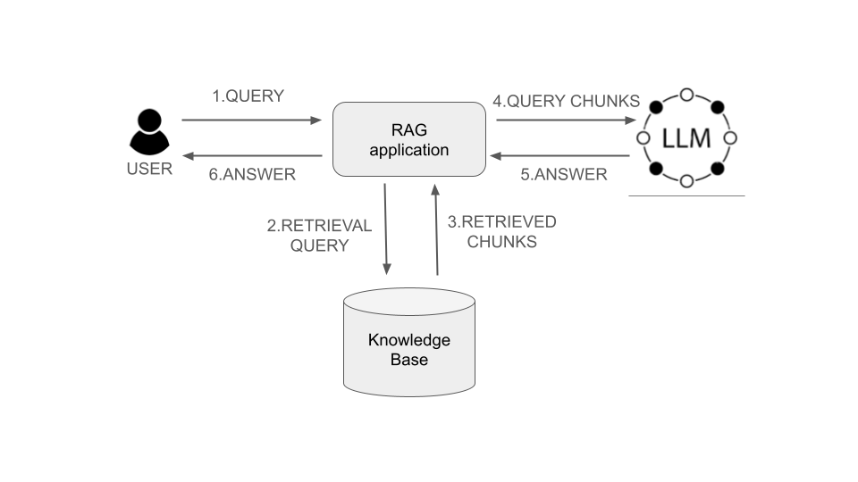
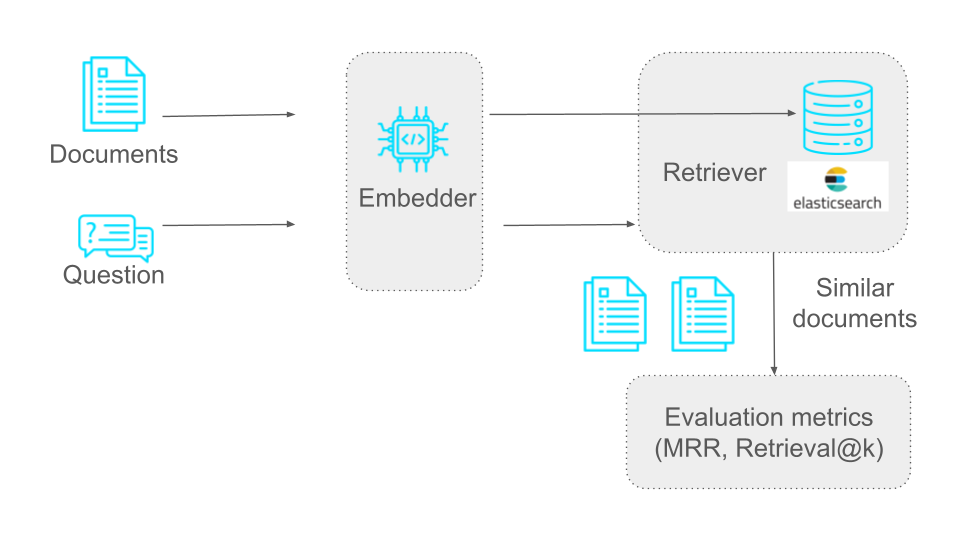
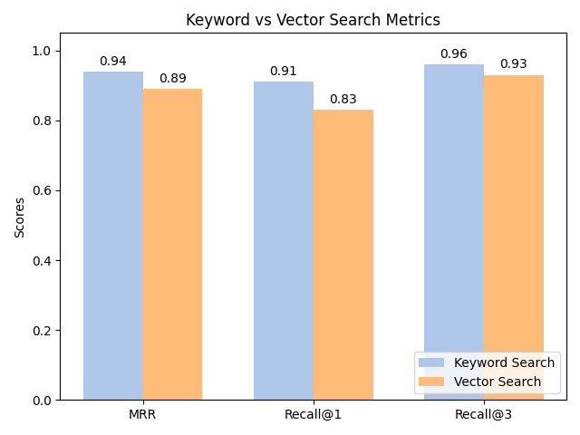
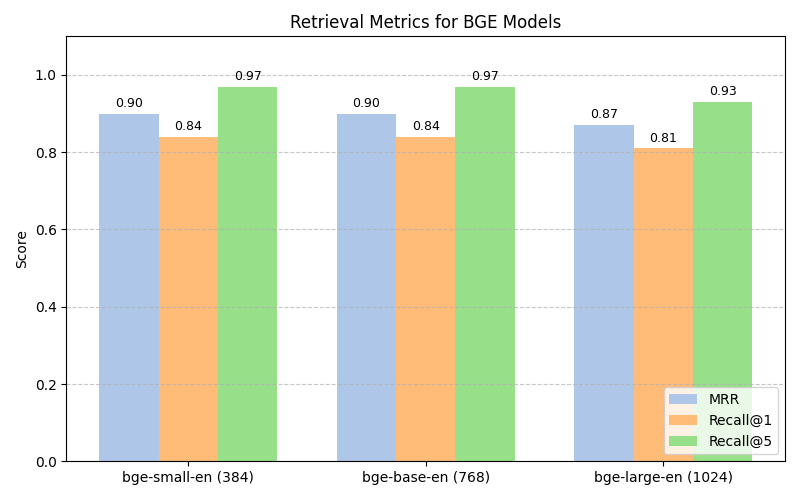
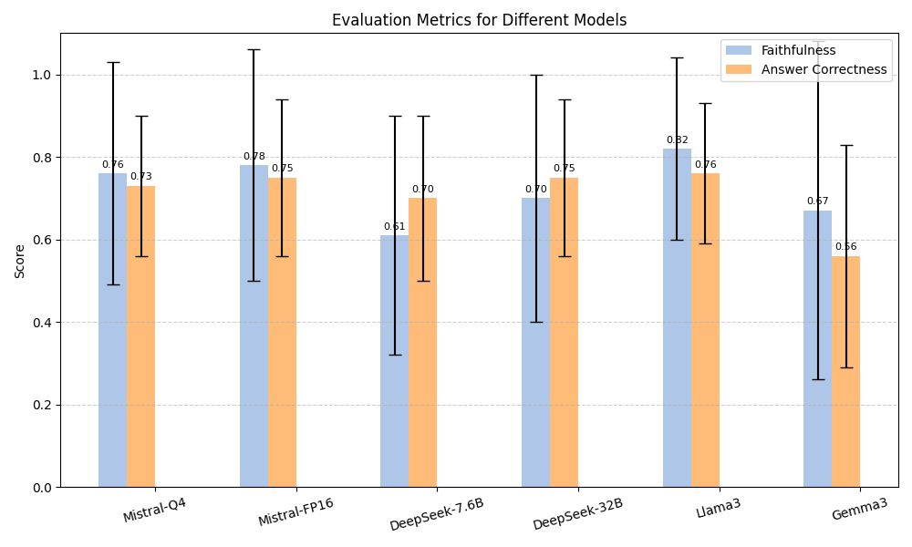
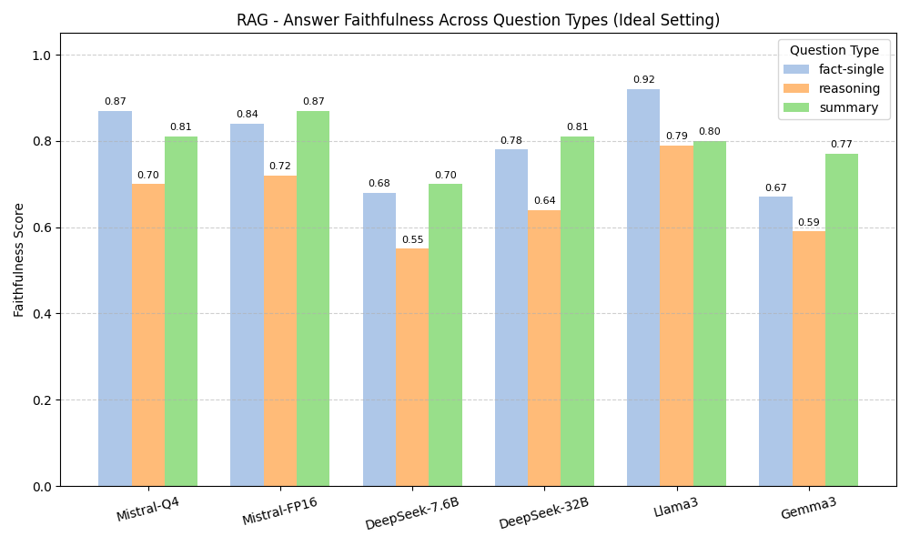
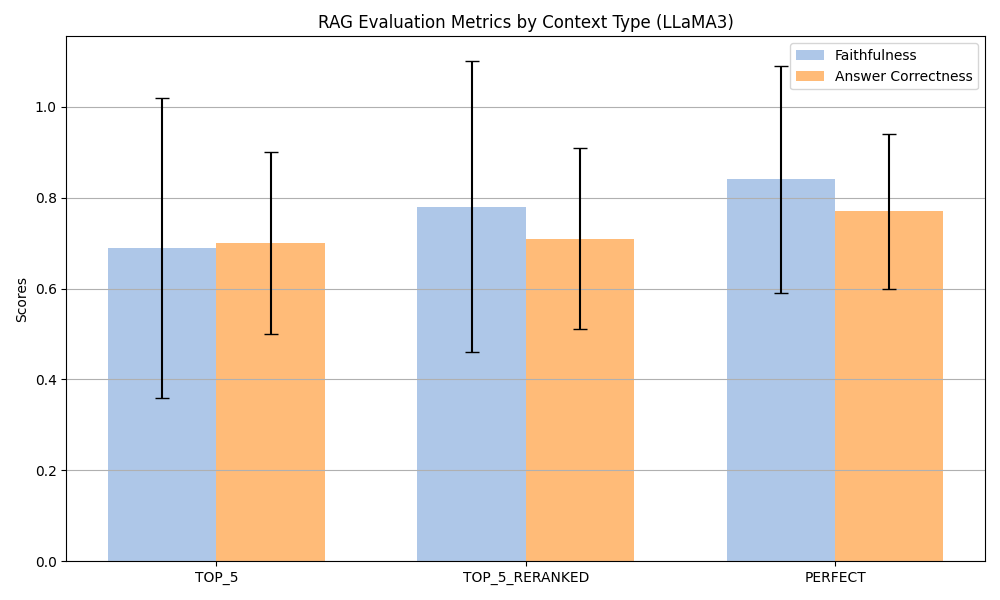

# **Benchmarking Open-Source LLMs in RAG Systems with Diploma Abstracts**

**Authors**:

**Margit ANTAL** (Sapientia University, Romania)
Krisztian BUZA (Budapest University of Economics and Business, Budapest, Hungary)

MathInfo 
September 8-12, 2025

---
## **RAG System Architecture**
Architecture 
 

[source](https://substackcdn.com/image/fetch/f_auto,q_auto:good,fl_progressive:steep/https%3A%2F%2Fsubstack-post-media.s3.amazonaws.com%2Fpublic%2Fimages%2F0005cb44-e213-42ff-9dae-312b49c0b191_2000x1190.jpeg)

---

## **Introduction to RAG Systems**

*   **Retrieval-Augmented Generation (RAG) systems** enhance Language Model (LLM) performance.
*   They **ground LLMs in external knowledge sources**, such as vector databases.
*   **Challenge**: Evaluating the effectiveness of RAG systems, as both **retrieval** and **generation** components must be assessed.
---

## **The Challenge of RAG Evaluation**

*   **Evaluation benchmarks** often lack complexity and domain specificity needed for comprehensive RAG assessment.
*   There is a necessity for **robust datasets** and **metrics** that accurately reflect real-world applications.
*   Evaluation must assess both **Retrieval** and **Generation** independently and in **combination**.

---

## **Our Contributions**

1.  Creation of a novel, **domain-specific dataset** for RAG evaluation using diploma thesis abstracts.
1.  **Categorization of questions** into `summary`, `single fact`, and `reasoning` types.
1.  Comprehensive **evaluation** of a RAG pipeline:
    *   Retriever performance: **lexical** and **semantic search**.
    *   Generation efficacy: **faithfulness** and **answer correctness** 

---

## **The *SapiTheses* Dataset**

*   **Source documents**: **227** English abstracts of diploma theses
*   **Question-Answer pair generation**:
    *   Used **Ragas** to generate questions
    *   Each question relates to a single document (**single hop**) 
    *   **GPT-4o** was used by Ragas for question and answer generation.
    *   **122 human-reviewed questions** remained after removing overly simple or general ones.

---

## **Question Categorization Taxonomy**

* **Fact Single Questions**: Seek **direct factual information** explicitly present in the abstract.
    
*   **Reasoning Questions**: Require **logical inference or multi-step reasoning** based on the abstract; the answer is inferred, not explicit.
   
*   **Summary Questions**: Ask for a **condensed version or key points** of the abstract.
   
*   **Dataset Distribution**: **25** fact single, **73** reasoning, **24** summary questions.
---
## **RAG System Evaluation**
Retriever Evaluation 
 

---

## **Retrieval Subsystem**

*   **Tool**: *Elasticsearch*
*   **Search Strategies Employed**:
    *   **Lexical Search**:
        *   **BM25** ranking algorithm.
    *   **Semantic Search**:
        *   **Embeddings** generated by the `all-mpnet-base-v2` model --> **768-dimensional** embeddings.

---
## **Retrieval Quality Metrics**

*   **Mean Reciprocal Rank (MRR)**: Ranks the first relevant document's position.
*   **Recall@k**: Frequency of the accurate context being found within the **top k** result.

---
## **Retriever Performance Insights**

Embedding model: `all-mpnet-base-v2 (768)`  
 

---
## **Retriever Performance - BGE models**

Embedding models: `small (384)`, `base (768)`, `large(1024)`  

---
## **Answer Generation Subsystem**

*   **Open-Source LLMs tested**:
    *   Mistral-Q4 (7.0B, 32K context)
    *   Mistral-FP16 (7.0B, 32K context)
    *   DeepSeek-r1-7.6B (7.6B, 128K context)
    *   DeepSeek-r1-32B (32.0B, 128K context)
    *   Llama3 (8.0B, 8K context)
    *   Gemma3 (7.0B, 8K context)

---
## **Generation Performance Metrics**    

*   **Faithfulness**: Checks if the answer is **factually consistent with the retrieved context**, helping identify hallucination.
*   **Answer Relevance**: Measures how well the **answer addresses the input question**.
*   **Semantic Similarity**: Assesses **content overlap** between the generated and reference answers.
*   **Answer Correctness**: Overall judgment of **accuracy**, considering factual content and semantic alignment.

---

## **Generation Performance - Ideal Setting**

  LLM prompted with the original abstract (100% relevant)  

---

## **Generation Performance - Real Setting**

 LLM prompted with TOP 3 abstracts (reranked)  

<!-- *   **Setup**: Top **3** most similar documents retrieved, then **re-ranked** by `cross-encoder/ms-marco-MiniLM-L-6-v2`.

<!-- *   **Llama3** remains the **strongest overall performer** with high faithfulness (0.76) and solid correctness (0.71), demonstrating **robustness to real-world retrieval imperfections**.
*   **Mistral-Q4 and Mistral-FP16** also showed **stable performance** with only small declines, indicating robustness.
*   **DeepSeek models** experienced moderate to significant drops in faithfulness and answer relevance, suggesting **higher sensitivity to retrieval imperfections**.
*   **Gemma3** remained the **weakest model** by a large margin.
*   **Crucial Insight**: Real-world RAG performance is **consistently lower than in ideal conditions**, highlighting the critical importance of high-quality document retrieval. --> 

---

## **Performance Across Question Types**

 LLM prompted with the original abstract (PERFECT)  

<!-- *   **Llama3** is the **most accurate and reliable across all question types**.
*   **Mistral models** perform well, especially for **fact-based and summary questions**.
*   **Reasoning questions prove challenging for all models**, consistently yielding lower faithfulness scores. Even with relevant context, multi-step inference poses difficulties.
*   **Fact-based questions consistently yield the highest faithfulness scores** across models, confirming LLMs' adeptness at direct factual queries. -->

---
## **Reranking effect**

 Llama3 prompted with: PERFECT, TOP 5, TOP 5 reranked  

---

## **Conclusions**

*   **Lexical and semantic search methods have distinct strengths**: Consider Hybrid search

* **Embedding choice is critical**: Mid-sized embeddings often outperform larger ones in retrieval tasks.

*   **Llama3 and Mistral models offer balanced performance** in faithfulness and correctness. 

*   **Reranking** improves **generation** quality.

*   **Reasoning-heavy questions remain a challenge** for RAG systems.

