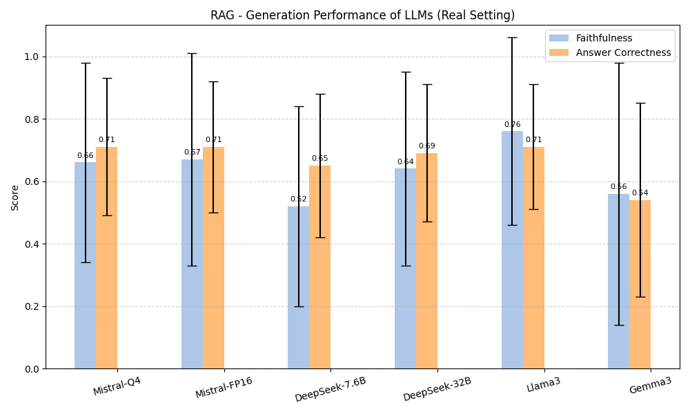

# **Benchmarking Open-Source LLMs in RAG Systems with Diploma Abstracts**

**Authors**:

**Margit ANTAL** (Sapientia University, Romania)
Krisztian BUZA (Budapest University of Economics and Business, Budapest, Hungary)

MathInfo 
September 8-12, 2025

---
## **Why RAG?**

- LLMs are not up to date, **hallucinate** 
- You want answers based on **your own private data**

---
## **RAG System Architecture**
RAG = Information Retrieval + Generative AI 
 

---
## **RAG Architecture**
Details 

---
## **RAG - Challenges**
Challenges

---

## **Our RAG challenges**

- How to encode?
- How to pass the context?
- How to verify?
---
## **Our RAG challenges**

- How to encode? = **Embedder model**
- How to pass the context? = **Number of similar chunks + Reranking**
- How to verify? = **Dataset + Metrics**

---

## **The *SapiTheses* Dataset**
### **Creation**

---

## **The *SapiTheses* Dataset**
### **Question Categorization Taxonomy**

* **Fact Single Questions (25)**: Seek *direct factual information* explicitly present in the abstract.
    
*   **Reasoning Questions (73)**: Require *logical inference or multi-step reasoning* based on the abstract; the answer is inferred, not explicit.
   
*   **Summary Questions (24)**: Ask for a *condensed version or key points* of the abstract.
   
---
## **RAG System Evaluation**
Retriever Evaluation
 

---

## **Retrieval Subsystem**

*   **Tool**: *Elasticsearch*
*   **Search Strategies Employed**:
    *   **Lexical Search**:
        *   **BM25** ranking algorithm.
    *   **Semantic Search**:
        *   **Embeddings** generated by the `all-mpnet-base-v2` model --> **768-dimensional** embeddings.

---
## **Retrieval Quality Metrics**

*   **Mean Reciprocal Rank (MRR)**: `rank_i` - the rank position of the first relevant document for the i-th query.
 
*   **Recall@k**: Frequency of the relevant document being found within the **top k** result.

---
## **Retriever Performance Insights**

Embedding model: `all-mpnet-base-v2 (768)`  
 

---
## **Retriever Performance - BGE models**

Embedding models: `small (384)`, `base (768)`, `large(1024)`  

---
## **Answer Generation Subsystem**
### **Open-Source LLMs tested**:
- Mistral-Q4 (7.0B, 32K context)
- Mistral-FP16 (7.0B, 32K context)
- DeepSeek-r1-7.6B (7.6B, 128K context)
- DeepSeek-r1-32B (32.0B, 128K context)
- Llama3 (8.0B, 8K context)
- Gemma3 (7.0B, 8K context)

---
## **Generation Performance Metrics**    

*   **Faithfulness**: Checks if the answer is *factually consistent with the retrieved context*, helping identify hallucination.
*   **Answer Relevance**: Measures how well the *answer addresses the input question*.
*   **Semantic Similarity**: Assesses *content overlap* between the generated and reference answers.
*   **Answer Correctness**: Overall judgment of *accuracy*, considering factual content and semantic alignment.

---
## **Faithfulness**    

- **Question:** When and where was Einstein born?
- **Context:** Albert Einstein *(born 14 March 1879)* was a *German-born* theoretical physicist, widely held to be one of the greatest and most influential scientists of all time.

- **High faithfulness answer:** Einstein was born in `Germany` on `14th March 1879`.

- **Low faithfulness answer:** Einstein was born in `Germany` on `20th March 1879`.

---

## **Generation Performance - Ideal Setting**
LLM + original abstract (100% relevant)

---

## **Generation Performance - Real Setting**
LLM prompted + TOP 3 abstracts (reranked)

---

## **Performance Across Question Types**
LLM + original abstract (PERFECT)

---
## **Reranking effect**
Llama3 + (PERFECT, TOP 5, TOP 5 reranked)

---

## **Conclusions**

*   **Lexical** and **semantic search** methods have distinct strengths: consider **hybrid search**

* **Embedding choice is critical**: Mid-sized embeddings often outperform larger ones in retrieval tasks.

*   **Llama3 and Mistral models offer balanced performance** in faithfulness and correctness. 

*   **Reranking** improves **generation** quality.

*   **Reasoning-heavy questions remain a challenge** for RAG systems.

